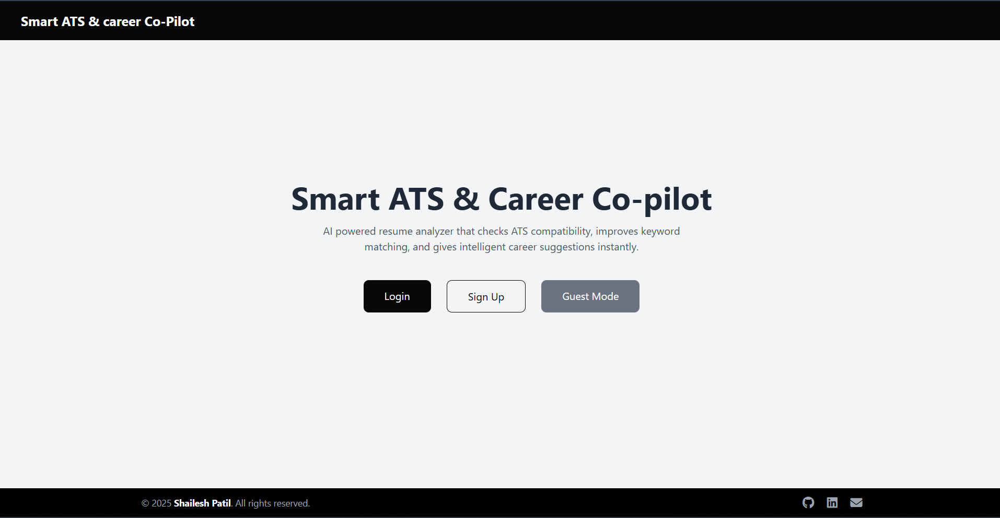
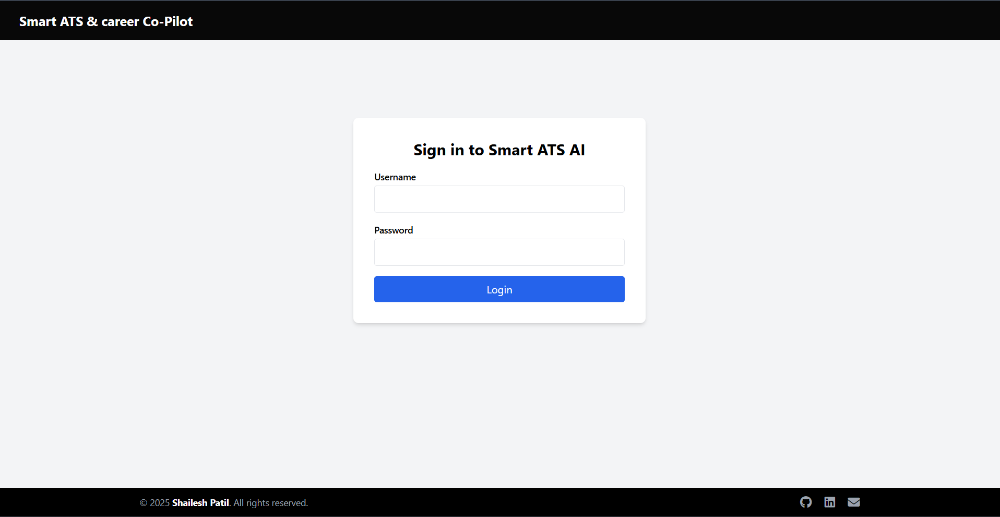
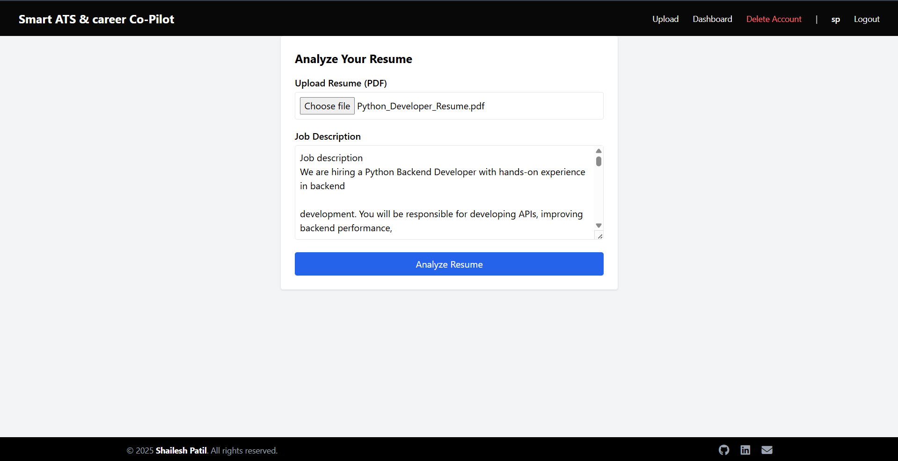
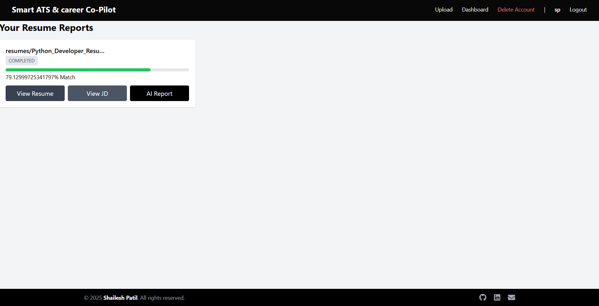
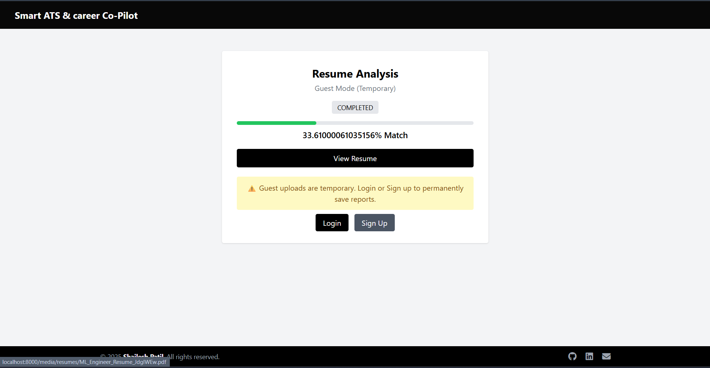

# Smart ATS & Career Co-Pilot


AI-powered resume + job description analyzer built with Django and Celery.

This project lets authenticated users upload a PDF resume and paste a job description. A Celery worker extracts text from the PDF, runs lightweight NLP-style preprocessing (cleaning + tokenization) to compare resume vs job description keywords, computes an ATS-style match score + missing keywords, and generates simple suggestions based on the missing keywords.


## Demo Video

[▶️ Click here to watch the video](https://drive.google.com/file/d/1ffmecjfI9RfC-dvah5p6hJ38zranZHFH/view?usp=sharing)


## What’s implemented

- Resume upload (PDF) + job description input
- Background processing with Celery + Redis
- Text extraction via `pdfminer.six`
- NLP-style text preprocessing (normalization/tokenization) + keyword matching
- ATS-style match score and missing keyword list
- Keyword-based suggestions
- Dashboard (history) + report view per upload
- Authentication via Django’s built-in auth (login/logout)

## NLP (highlight)

The “NLP” part in this project is intentionally lightweight and practical:

- Extract raw text from the uploaded PDF
- Normalize text (lowercasing, removing punctuation/noise, collapsing whitespace)
- Tokenize into words and compute overlap between resume vs job description
- Identify missing keywords and compute a weighted match score

## Tech stack

- Django 4.2
- Celery + Redis
- django-celery-results (stores task results in DB)
- SQLite (default)
- Tailwind (via CDN in templates)

## Screenshots

### Home


### Login


### Upload


### Dashboard


### Guest Mode


## Local setup (Windows)

### 1) Create a virtual environment + install deps

```bat
python -m venv venv
venv\Scripts\activate
pip install -r requirements.txt
```

### 2) Configure environment variables

Optional: create a `.env` file in the project root (same folder as `manage.py`) for standard Django settings you may want to externalize.

### 3) Start Redis

You need a Redis server running locally because Celery uses it as the broker.

If you already have Redis installed, start it (example):

```bat
redis-server
```

### 4) Migrate DB and create a user

```bat
python manage.py migrate
python manage.py createsuperuser
```

### 5) Run Django

```bat
python manage.py runserver
```

Open:
- App: http://127.0.0.1:8000/
- Login: http://127.0.0.1:8000/accounts/login/
- Admin: http://127.0.0.1:8000/admin/

### 6) Run the Celery worker (new terminal)

```bat
celery -A ats_core worker -l info -P solo
```

## How it works (high level)

1. User uploads a resume + job description.
2. A `ResumeUpload` record is created and a Celery task is queued.
3. Worker extracts resume text, computes match score + missing keywords.
4. Worker generates suggestions from missing keywords and stores them.
5. User views results in the dashboard/report screens.

## Project structure (key parts)

- `ats_core/` – Django project settings/urls + Celery config
- `uploads/` – upload views, URLs, and `ResumeUpload` model
- `analyzer/` – PDF parsing + ATS scoring + Celery tasks
- `templates/` – UI templates (upload, dashboard, report, login)

## Troubleshooting

- If uploads stay in `PENDING`, make sure:
	- Redis is running
	- the Celery worker is running
- If PDF text extraction returns empty text, try a different PDF (some PDFs are image-only scans).
